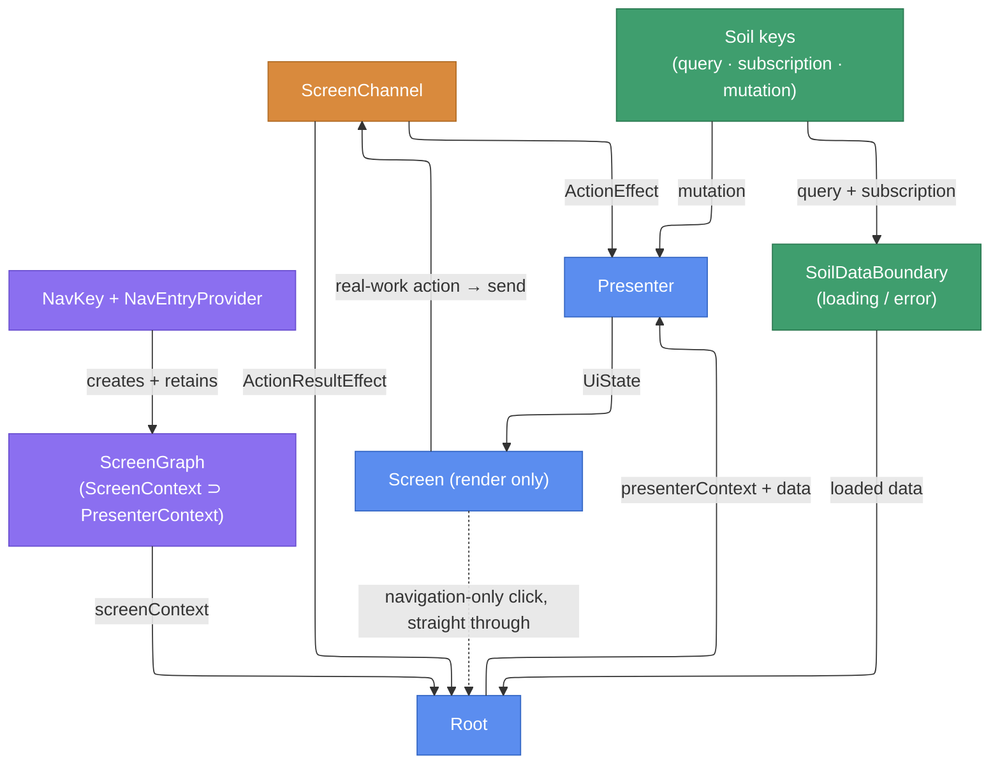

# Building a screen

Each decision below has an authoritative page of its own; this page assembles them into a build order for one screen. It walks `:feature:sessions`'s **TimetableScreen** (timetable list, favorites, and navigation to detail) from the data layer up to navigation. For how a screen sits inside the app as a whole, see [Architecture overview, section 4](./architecture-overview.md#_4-inside-a-screen); this page instructs, that page narrates.

> **Fast path — scaffold first.** `scripts/new-screen.sh --feature <feature> --screen <Screen>` generates every file below (across `:core:model` / `feature` / `app-shared`), compiling on all targets and passing every FIR checker. For Claude Code, the `new-screen` skill wraps it. Use the generated files as the skeleton and fill in the fetch, contract, and UI. See [AI-assisted development](./ai-development.md).

## The cast and their relationships

One diagram is the map the rest of the page walks. Each node is a file (or small file cluster) you write; each section below focuses on one node and states what to put in it.

Colors mark the layers: purple = navigation & DI, blue = the screen triad, amber = the one-off channel, green = Soil data.



Two edges out of `Screen` are the crux: a **real-work** click travels the channel to the presenter; a **navigation-only** click is forwarded straight back through the Root's navigation lambda and never reaches the presenter. Wiring a channel action that only forwards to navigation is rejected by the `NoForwardOnlyActionChecker` FIR checker.

## Data layer — Soil keys

**Diagram: the `Soil keys` node.** Key **contracts** are typealiases in `:core:model` (one file per key); the `Default*Key` **implementations** live in `:core:data`. Each id comes from the KSP-generated `SoilIds` object, so ids stay stable and cannot collide by hand.

Do here:
- Declare one typealias per key in `:core:model`; bind one `Default*Key` per key in `:core:data`.
- **Concentrate heavy shaping (`groupBy` / `sortedBy` / joins) in `fetch`**, not in the presenter — see [Presenter performance](./presenter-performance.md).
- Persist the raw server response with `buildPersistedQueryKey` (an explicit `persistKey`; the persisted type must be `@Serializable`, enforced at compile time).
- Bind the mutation key into the per-screen scope and take a `MutationTag`, so each screen keeps a separate mutation cache.

```kotlin
// :core:data — shaping happens in fetch; the raw response is what gets persisted.
@Inject
@ContributesBinding(AppScope::class)
class DefaultTimetableQueryKey(
    private val api: TimetableApi,
    private val fileStorage: ServerEnvironmentScopedFileStorage,
) : TimetableQueryKey by buildPersistedQueryKey(
    id = SoilIds.timetableQuery,          // generated from the typealias fully-qualified name
    persistKey = "timetable",             // stable, explicit persisted-cache identity
    fileStorage = fileStorage,
    fetchResponse = { api.getTimetable() },
    transformToDomainModel = { response -> Timetable(items = response.toTimetableItems().toPersistentList()) },
)

@Inject
@ContributesBinding(TimetableScreenScope::class)
@ContributesBinding(TimetableItemDetailScreenScope::class)
class DefaultFavoriteTimetableItemIdMutationKey(
    extraTag: MutationTag,                // provided by each screen's @GraphExtension
    private val store: FavoritesStore,
) : FavoriteTimetableItemIdMutationKey by buildMutationKey(
    id = SoilIds.favoriteTimetableItemIdMutation(extraTag),  // tag flows into the id (per-screen isolation)
    mutate = { id -> store.toggle(id) },
)
```

A derived read reuses a shared key via `rememberQuery(key, select)` rather than adding one — the detail screen selects its single item from the shared timetable cache. See [Soil keys](./soil-keys.md) and [Soil mutation](./soil-mutation.md).

## Contexts — ScreenContext holds PresenterContext

**Diagram: the `ScreenGraph` node.** Both contexts are concrete `@Inject` classes. `ScreenContext` **holds** a `PresenterContext` as a property (composition), it does not inherit it.

Do here:
- Put only the presenter-role dependencies (mutation keys) in `PresenterContext`.
- Put the query and subscription keys plus the `presenterContext` instance in `ScreenContext`; annotate it `@SingleIn(<ScreenScope>::class)`.

```kotlin
@Inject
class TimetablePresenterContext(
    val favoriteTimetableItemIdMutationKey: FavoriteTimetableItemIdMutationKey,
    override val logger: KaigiLogger,
) : PresenterContext

@Inject
@SingleIn(TimetableScreenScope::class)
class TimetableScreenContext(
    val timetableQueryKey: TimetableQueryKey,
    val favoriteTimetableIdsSubscriptionKey: FavoriteTimetableIdsSubscriptionKey,
    override val logger: KaigiLogger,
    val presenterContext: TimetablePresenterContext,  // holds the instance; not `: TimetablePresenterContext`
) : ScreenContext
```

Composition (holds), not inheritance (is-a): were it is-a, the `ScreenContext` that Root holds would also satisfy `PresenterContext`, leaking the action-consume capability into Root. That mistake is rejected by a FIR checker. For the reasoning, retain, and the per-screen `@GraphExtension` trio, see [ScreenContext design](./screen-context.md).

## Action / ActionResult / UiState

**Diagram: the labels on the `ScreenChannel` edges.** `Action` is the channel input (UI → presenter), `ActionResult` the one-off output (presenter → Root), `UiState` the render input.

Do here:
- Declare each of the three in its own file, named after the declaration (`<Screen>ScreenAction.kt`, `<Screen>ScreenActionResult.kt`, `<Screen>ScreenUiState.kt`). A screen with no action and no one-off declares only `UiState`.
- List only **real-work** actions in `Action` (no navigation-only cases).
- Keep `UiState` immutable (immutable collections) for strong-skipping.

```kotlin
sealed interface TimetableScreenAction {                     // real-work input only
    data class Bookmark(val id: TimetableItemId) : TimetableScreenAction
    data class SelectDay(val day: DroidKaigi2026Day) : TimetableScreenAction
    // no ClickItem: opening a detail is navigation-only, wired Screen → Root directly
}

sealed interface TimetableScreenActionResult {               // one-off, presenter → Root
    data class ShowMessage(val message: UserMessage) : TimetableScreenActionResult
}

data class TimetableScreenUiState(
    val day: DroidKaigi2026Day,
    val sessions: PersistentList<TimetableItem>,
    val bookmarks: PersistentSet<TimetableItemId>,
)
```

## Presenter — compute-light, PresenterContext only

**Diagram: the `Presenter` node.** It reads Soil keys through `PresenterContext`, consumes actions via `ActionEffect`, and returns an immutable `UiState`.

Do here:
- Declare `context(presenterContext: <PresenterContext>)`, mark it `@Composable`.
- Consume input in `ActionEffect`; drive writes with `mutateAsync` (never `mutate`).
- Surface one-offs by calling `emit` from a mutation effect. Keep the body cheap — no heavy shaping.

```kotlin
context(presenterContext: TimetablePresenterContext)
@Composable
fun timetableScreenPresenter(
    screenChannel: ScreenChannel<TimetableScreenAction, TimetableScreenActionResult>,
    timetable: Timetable,                            // arrives non-null from SoilDataBoundary
): TimetableScreenUiState {
    val favoriteMutation = rememberMutation(presenterContext.favoriteTimetableItemIdMutationKey)
    var selectedDay by retain { mutableStateOf(DroidKaigi2026Day.Day1) }

    ActionEffect(screenChannel) { action ->
        when (action) {
            is TimetableScreenAction.Bookmark  -> favoriteMutation.mutateAsync(action.id)
            is TimetableScreenAction.SelectDay -> selectedDay = action.day
        }
    }
    MutationErrorEffect(favoriteMutation) { error ->     // success reflects via the subscription; surface only failures
        screenChannel.emit(TimetableScreenActionResult.ShowMessage(error.toUserMessage()))
        favoriteMutation.reset()
    }

    return TimetableScreenUiState(
        day = selectedDay,
        sessions = timetable.itemsOn(selectedDay),       // cheap bucket lookup
        bookmarks = timetable.bookmarks,
    )
}
```

`emit` is `suspend`, so it can only fire from inside an effect, sealing off accidental firing from the composition body. Why `mutate` is forbidden (the `NoDirectMutate` checker) and how to choose between the mutation effects: [Soil mutation](./soil-mutation.md).

## Screen — rendering only

**Diagram: the `Screen` node.** A pure `@Composable` of `UiState` plus callbacks; it never touches Soil or the channel.

Do here:
- Render `uiState`; invoke each callback from the control the user interacts with.
- Keep the two callback kinds distinct: real-work clicks and the navigation-only click are both just lambdas here — the Root decides where each goes.

```kotlin
@Composable
fun TimetableScreen(
    uiState: TimetableScreenUiState,
    onBookmarkClick: (TimetableItemId) -> Unit,
    onDayClick: (DroidKaigi2026Day) -> Unit,
    onItemClick: (TimetableItemId) -> Unit,          // navigation-only click
) {
    // Render uiState; a click just invokes the passed callback.
}
```

## Root — data boundary, channel, and wiring

**Diagram: the `Root` node** — the hub every other edge meets. Its role is identified by the `ScreenContext` context parameter plus the `*ScreenRoot` name; there is no annotation.

Do here, in order:
- Open [`SoilDataBoundary`](./soil-data-boundary.md) over the query and subscription (loading and error fallbacks are handled here).
- Create the channel with `retainScreenChannel`; handle presenter-originated one-offs in `ActionResultEffect`.
- Compute `UiState` by wrapping **only** the presenter call in `context(screenContext.presenterContext) { … }`.
- Render `Screen`: route real-work clicks to `screenChannel.send(…)`, and forward the navigation-only click straight to the Root's navigation lambda.

```kotlin
context(screenContext: TimetableScreenContext)
@Composable
fun TimetableScreenRoot(onNavigateToDetail: (TimetableItemId) -> Unit) {
    SoilDataBoundary(
        state1 = rememberQuery(screenContext.timetableQueryKey),
        state2 = rememberSubscription(screenContext.favoriteTimetableIdsSubscriptionKey),
    ) { timetable, favoriteIds ->
        val screenChannel = retainScreenChannel<TimetableScreenAction, TimetableScreenActionResult>()
        val snackbarHostState = LocalSnackbarHostState.current

        ActionResultEffect(screenChannel) { result ->
            when (result) {
                is TimetableScreenActionResult.ShowMessage -> snackbarHostState.showSnackbar(result.message.text)
            }
        }

        val uiState = context(screenContext.presenterContext) {    // wrap only the presenter call
            timetableScreenPresenter(
                screenChannel = screenChannel,
                timetable = timetable.copy(bookmarks = favoriteIds),   // lightweight join
            )
        }
        TimetableScreen(
            uiState = uiState,
            onBookmarkClick = { screenChannel.send(TimetableScreenAction.Bookmark(it)) },  // send = ScreenContext-gated
            onDayClick      = { screenChannel.send(TimetableScreenAction.SelectDay(it)) },
            onItemClick     = onNavigateToDetail,   // navigation-only: forward the nav lambda, no presenter round-trip
        )
    }
}
```

`LocalSnackbarHostState` is supplied by a per-entry Snackbar `NavEntryDecorator`. Once a join grows heavy (synchronizing several independent sources), move it from `content` into a `SubscriptionKey`'s `combine(…)`. See [Error handling](./error-handling.md) and [Presenter performance](./presenter-performance.md).

## Navigation — NavKey, entry, and the per-screen graph

**Diagram: the `NavKey + NavEntryProvider` node feeding the `ScreenGraph`.**

Do here:
- Declare a `@Serializable` `NavKey` in commonMain.
- Contribute a `NavEntryProvider` with `@ContributesIntoSet(UiScope::class)` (the central `NavDisplay` is never edited).
- In the entry, `retain` the per-screen graph factory, open `graph.screenContext` around the Root, and pass navigation as `graph.screenNavigator::openSessionDetail`.

```kotlin
@Serializable
data object TimetableNavKey : NavKey

@ContributesIntoSet(UiScope::class)
@Inject
class TimetableNavEntryProvider(
    private val screenGraphFactory: TimetableScreenGraph.Factory,
) : NavEntryProvider {
    override fun EntryProviderScope<NavKey>.register() {
        entry<TimetableNavKey>(metadata = RootSceneStrategy.root()) {
            val graph = retain(screenGraphFactory::createTimetableScreenGraph)
            context(graph.screenContext) {
                TimetableScreenRoot(
                    onNavigateToDetail = graph.screenNavigator::openSessionDetail,
                )
            }
        }
    }
}
```

Root receives navigation as a lambda (a fake in tests and previews); the entry supplies it from the retained graph's `screenNavigator`, so the navigator never enters the `ScreenContext`. Navigation flows through the screen-specific `TimetableScreenNavigator` (interface in the feature, `DefaultTimetableScreenNavigator` bound into the screen scope in `app-shared`) → `AppNavigator` → back stack. The per-screen `@GraphExtension` also `@Provides` this screen's `MutationTag`, and NavKey serializer registration is KSP-generated per feature. See [Navigation overview](./navigation.md) and [Navigator](./navigation-navigator.md).

## Naming conventions for Compose views

| Target | Naming | Example |
| --- | --- | --- |
| Screen entry | `<Feature>ScreenRoot` | `TimetableScreenRoot` |
| Screen rendering root | `<Feature>Screen` | `TimetableScreen` |
| Every other Compose view | `<Name><Kind>` (kind suffix mandatory) | `TimetableView` / `SessionItem` / `FavoriteButton` |

Every Compose view other than `<Feature>Screen` must carry a kind suffix; a bare name like `Timetable` is forbidden (it collides with `:core:model`'s `Timetable`). Pick the most specific widget kind (`Button` / `Card` / `Item` / `Field` / `Dialog` / `Bar` / `Chip` / `Section` …); for a composite that fits none, use `View`. Screen-specific views live in `feature`; broadly reusable ones in `:core:ui`.

## Tests

Do here:
- Presenter unit test with `runPresenterTest` (Molecule internally): construct a fake `PresenterContext` directly with a fake key, then assert `UiState` transitions on `uiStates` and one-offs on `results`.
- Screen test: a [Robot test](./testing-robot.md) composing the real `TimetableScreenRoot`, plus Roborazzi screenshots of the previews in `TimetableScreen.kt`.

```kotlin
@Test
fun selectDay_switchesSessions() {
    val favoriteKey: FavoriteTimetableItemIdMutationKey = buildMutationKey(
        id = MutationId("test-favorite"),
        mutate = { /* record */ },
    )
    runPresenterTest(
        presenterContext = TimetablePresenterContext(
            favoriteTimetableItemIdMutationKey = favoriteKey,
            logger = FakeKaigiLogger(),
        ),
        presenter = { channel -> timetableScreenPresenter(channel, sampleTimetable) },
    ) {
        uiStates.awaitItem()                                            // initial UiState (Day1)
        send(TimetableScreenAction.SelectDay(DroidKaigi2026Day.Day2))
        assertEquals(DroidKaigi2026Day.Day2, uiStates.awaitItem().day)
    }
}
```

A navigation-only click has no presenter path to test — it is wired Screen → Root directly. See [Presenter testing](./testing-presenter.md).

## Appendix — file layout

```text
core/model/.../TimetableQueryKey.kt etc.                   // one file per key typealias (contract)
core/model/.../TimetableScreenScope.kt                    // @GraphExtension scope marker(s)
core/model/.../Timetable.kt                               // domain models
core/data/.../Default*Key.kt                              // one file per key impl (shaping in fetch)
feature/sessions/.../timetable/TimetableScreenContext.kt  // PresenterContext + ScreenContext
feature/sessions/.../timetable/TimetableScreenGraph.kt    // per-screen @GraphExtension (+ MutationTag @Provides)
feature/sessions/.../timetable/TimetableScreenAction.kt   // one file per contract declaration
feature/sessions/.../timetable/TimetableScreenActionResult.kt
feature/sessions/.../timetable/TimetableScreenUiState.kt
feature/sessions/.../timetable/TimetableScreenPresenter.kt
feature/sessions/.../timetable/TimetableScreen.kt         // Screen + previews
feature/sessions/.../timetable/TimetableScreenRoot.kt
feature/sessions/.../timetable/TimetableScreenNavigator.kt
feature/sessions/.../timetable/TimetableNavKey.kt
feature/sessions/.../timetable/TimetableNavEntryProvider.kt
feature/sessions/src/commonTest/.../timetable/TimetableScreenPresenterTest.kt
feature/sessions/src/commonTest/.../timetable/TimetableScreenRobot.kt + TimetableScreenRobotTest.kt
app-shared/.../DefaultTimetableScreenNavigator.kt         // Navigator impl, bound into the screen scope
```

Related: [Architecture overview](./architecture-overview.md) · [ScreenContext design](./screen-context.md) · [Error handling](./error-handling.md) · [Soil keys](./soil-keys.md) · [Soil mutation](./soil-mutation.md) · [Presenter performance](./presenter-performance.md) · [Navigation overview](./navigation.md) · [Enforcement](./enforcement.md) · [AI-assisted development](./ai-development.md)
