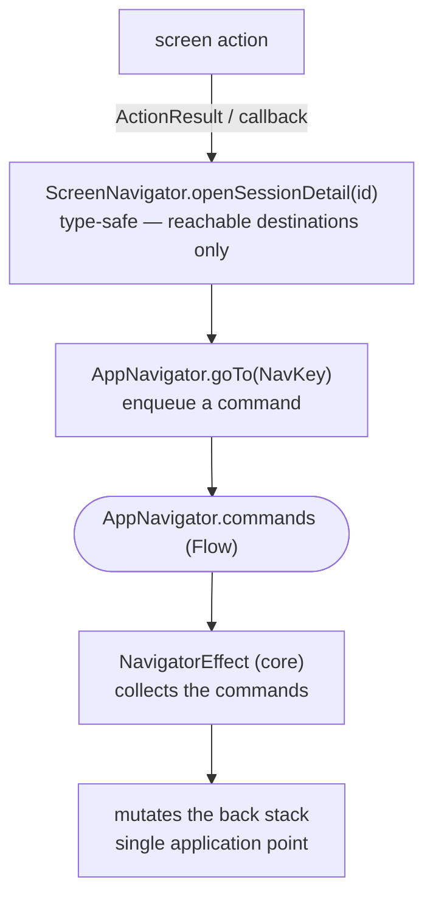

# Navigator

Editing `KaigiApp`'s `NavDisplay` by hand for every screen change risks breaking navigation and causes merge conflicts. So each feature registers its `NavEntry` through an interface that **Metro aggregates automatically** — `KaigiApp` is never touched. That isolation removes a feature's direct handle on the back stack (it used to be a passed-in lambda), so navigation is **abstracted through a Navigator**: a feature emits a command over a Flow, applied to the back stack in exactly one place.

## The flow

A navigation request travels this path end to end — from a screen action to the single point that mutates the back stack:



## AppNavigator + NavigatorEffect (core)

`AppNavigator` and `NavigatorEffect` are the primitive navigation mechanism, handling `NavCommand`s (`Push` / `Pop` / `MoveToTop`): `AppNavigator` emits them, and `NavigatorEffect` applies them to the back stack. `MoveToTop` is the [root tab bar](./navigation-root-tab-bar.md)'s command — it reorders the stack rather than popping it.

```kotlin
sealed interface NavCommand {
    data class Push(val key: NavKey) : NavCommand
    data class Pop(val origin: NavKey?) : NavCommand
    data class MoveToTop(val key: NavKey) : NavCommand
}

@Inject
@SingleIn(UiScope::class)
class AppNavigator(private val logger: KaigiLogger) : Navigator {
    private val commandChannel = Channel<NavCommand>(Channel.BUFFERED)
    val commands: Flow<NavCommand> = commandChannel.receiveAsFlow()
    fun goTo(key: NavKey) { commandChannel.trySend(NavCommand.Push(key)) }
    fun back(origin: NavKey? = null) { commandChannel.trySend(NavCommand.Pop(origin)) }
    fun moveToTop(key: NavKey) { commandChannel.trySend(NavCommand.MoveToTop(key)) }
}

@Composable
fun NavigatorEffect(navigator: AppNavigator, backStack: NavBackStack<NavKey>, logger: KaigiLogger) {
    LaunchedEffect(navigator, backStack) {
        navigator.commands.collect { command ->
            when (command) {
                is NavCommand.Push -> if (backStack.lastOrNull() == command.key) {
                    logger.warn { "Duplicate push of the top NavKey: ${command.key} — likely a caller bug" }
                } else {
                    backStack.add(command.key)
                }
                is NavCommand.Pop -> {
                    val top = backStack.lastOrNull()
                    if (command.origin != null && command.origin != top) {
                        logger.warn { "Stale pop from non-top NavKey: ${command.origin}; top is $top" }
                    } else if (backStack.size > 1) {
                        backStack.removeLastOrNull()
                    }
                }
                is NavCommand.MoveToTop -> if (backStack.lastOrNull() != command.key) {
                    backStack.remove(command.key)
                    backStack.add(command.key)
                }
            }
        }
    }
}
```

`AppNavigator` logs each command. `NavigatorEffect` additionally warns when it rejects a duplicate `Push` or a stale `Pop`.

## Back stack guards

`NavigatorEffect` is the single point that mutates the back stack, so the guarantees the back stack must hold are expressed there, as conditions on its current state:

- **A `Push` never repeats the key already on top.** A fast double tap on a navigation control fires the same lambda twice — the first tap pushes before the screen leaves composition, and the second repeats it — which would otherwise leave two identical entries on the stack. The key is compared against the top only, so a legitimate cycle still works: with `[A, B]` on the stack, pushing `A` again is a distinct destination and is applied. The skipped push is logged as a warning, because a caller that fires the same push twice is worth seeing.
- **A screen-originated `Pop` applies only while its origin is still on top.** Each NavEntry passes its own key as the command's `origin`. The first pop removes that entry; a second command from the same rapid tap then finds a different top key, is logged as stale, and is dropped. A valid pop still runs only while `size > 1`, so it can never remove the root.

`KaigiApp` calls `AppNavigator.back()` without an origin for platform and predictive back. An originless pop bypasses the stale-origin check but still keeps the root, so repeated back gestures can intentionally pop several screens.

These guards compare each command with current back-stack state rather than using a time window. A control remains immediately interactive, while only a command whose originating entry is no longer current is discarded.

## Implementing a screen-level Navigator

`<Feature>ScreenNavigator` is a feature-owned interface that exposes the screen's outgoing navigations as type-safe methods (`openSessionDetail(id)`) — no `NavKey`, no back stack. Its `Default…` implementation is injected from **app-shared** (the one module that sees every feature); for in-app navigation, it maps each call to a concrete `NavKey` and pushes it via `AppNavigator`:

```kotlin
// feature:sessions — the intent, type-safe and NavKey-free
interface TimetableScreenNavigator {
    fun openSessionDetail(id: TimetableItemId)
}

// app-shared — sees every NavKey; @SingleIn the screen's scope, not UiScope
@Inject
@SingleIn(TimetableScreenScope::class)
@ContributesBinding(TimetableScreenScope::class)
class DefaultTimetableScreenNavigator(private val appNavigator: AppNavigator) : TimetableScreenNavigator {
    override fun openSessionDetail(id: TimetableItemId) = appNavigator.goTo(TimetableItemDetailNavKey(id))
}
```

The `ScreenRoot` consumes it as a plain lambda — it never holds the navigator or a `NavKey`, so it stays trivially testable:

```kotlin
// NavEntry registration (feature): the Root gets navigation as a plain lambda.
TimetableScreenRoot(
    onNavigateToDetail = { id: TimetableItemId -> graph.screenNavigator.openSessionDetail(id) },
)
```

Because the binding is `@SingleIn` the screen's scope, resolving the navigator from the app or UI graph is a Metro compile error — the DI graph confines it to the NavEntry layer, stronger than a checker or convention. (Only the shell's own calls — `AppNavigator.back()` and the tab bar's `moveToTop()` — stay UI-scoped.)

`graph` is the per-screen graph the NavEntry retains — see [NavEntry aggregation](./navigation-entry-aggregation.md) for how entries are registered and aggregated.

## External links

A destination outside the app — a sponsor's site, a contributor's profile — has no `NavKey` and never enters the back stack, so it does not belong to a `<Feature>ScreenNavigator`. The NavEntry supplies Compose's `LocalUriHandler` as the Root's navigation lambda instead, and the Root passes it on like any other:

```kotlin
entry<SponsorsNavKey> { key ->
    val graph = retain(screenGraphFactory::createSponsorsScreenGraph)
    val uriHandler = LocalUriHandler.current
    context(graph.screenContext) {
        SponsorsScreenRoot(
            onNavigateBack = { appNavigator.back(origin = key) },
            onNavigateToSponsorSite = uriHandler::openUri,
        )
    }
}
```

The Root and the Screen cannot tell the two apart: both receive an `on*` lambda. A screen whose only outgoing navigation is external therefore declares no navigator methods. An external link never enters the back stack, so the [back stack guards](#back-stack-guards) do not apply to it.

Related: [NavEntry aggregation (NavEntryProvider)](./navigation-entry-aggregation.md) · [NavKey serializer aggregation (NavKeySerializersProvider)](./navigation-navkey-serializers.md) · [enforcement](./enforcement.md)
