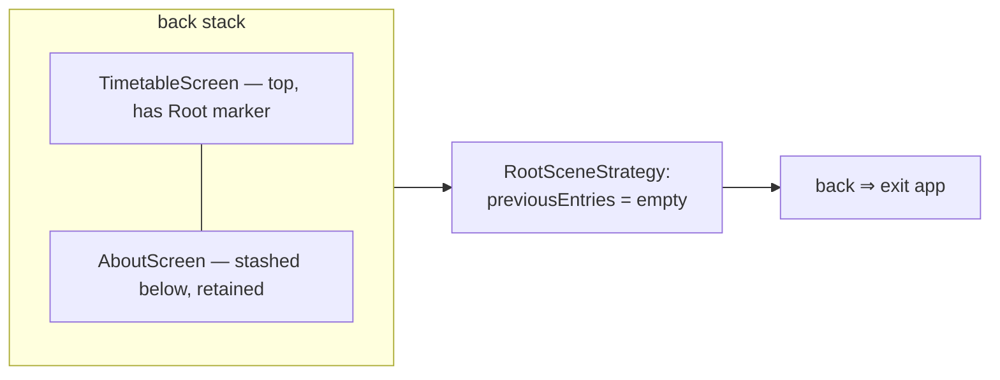
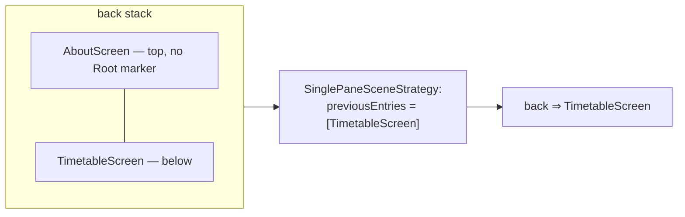

# Root NavEntry emulation (RootSceneStrategy)

`RootSceneStrategy` makes a chosen `NavEntry` behave as the **virtual root** of the back stack: even when that entry is not actually at the bottom (other tabs are stashed beneath it), it drives back input as if nothing were below — so back **exits the app** instead of revealing the stashed entry.

## Goals

- Back from a non-Timetable tab → returns to the **root stashed directly beneath it**.
- Back from Timetable → **exits the app** (predictive back on Android).
- Root tabs **retain their state** across navigation (which is what creates the predictive-back problem below).

## Predictive back via `previousEntries`

For per-tab state retention the app may keep other tabs' NavKeys **stashed below** the home root (Timetable) in a single back stack, so those tabs survive across navigation. But that leaves real entries beneath Timetable, and Nav3 derives the back-preview scene from a scene's **`previousEntries`** — so predictive back from Timetable would "reveal the entry below" instead of exiting the app.

The single back stack in two states — note the top entry decides the scene, and the scene's `previousEntries` decides what back does:

**State A — TimetableScreen on top, AboutScreen stashed below:**



The entry below TimetableScreen (AboutScreen) is real, but because TimetableScreen carries the Root marker, `RootSceneStrategy` reports an empty `previousEntries`, so back exits rather than revealing AboutScreen.

**State B — AboutScreen on top:**



AboutScreen has no marker, falls through to `SinglePaneSceneStrategy`, and its `previousEntries` is the real stack below, so back returns to TimetableScreen.

`RootSceneStrategy` fixes exactly that, and nothing else. It identifies the home root **by `NavEntry.metadata`**:

```kotlin
class RootSceneStrategy<T : Any> : SceneStrategy<T> {

    override fun SceneStrategyScope<T>.calculateScene(entries: List<NavEntry<T>>): Scene<T>? {
        val entry = entries.lastOrNull() ?: return null
        if (RootSceneMetadataKey !in entry.metadata) return null   // not the home root → fall through
        return RootScene(entry)                                    // previousEntries = emptyList()
    }

    companion object {
        fun root(): Map<String, Any> = metadata { put(RootSceneMetadataKey, true) }
    }
}

private data object RootSceneMetadataKey : NavMetadataKey<Boolean>
```

The `RootScene` that `RootSceneStrategy` returns reports `previousEntries = emptyList()`, so predictive back from the home root has nothing to fall back to and **exits the app** — no matter what is stashed underneath. Every other entry returns `null` and falls through to the remaining strategies in `sceneStrategies` — [the list-detail strategies](./navigation-list-detail.md), then `SinglePaneSceneStrategy`, whose `previousEntries` is the real `entries.dropLast(1)` — so back from a non-home root returns to the entry stashed beneath it.

The Root marker is attached to exactly the home-root entry, where that entry is registered:

```kotlin
entry<TimetableNavKey>(metadata = RootSceneStrategy.root() + …) { … }
```

Related: [Root tab bar (RootTabSceneDecorator)](./navigation-root-tab-bar.md) · [Architecture overview](./architecture-overview.md) · [Navigator](./navigation-navigator.md) · [Entry retention (RetainNavEntryDecorator)](./navigation-retain-entry-decorator.md)
