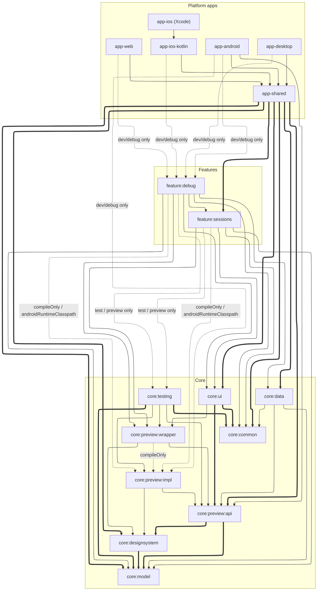

# Module structure

The project splits into four groups of modules — **`:core:*`**, **`:feature:*`**, **`:app-*`**, and **build-time tooling** — each described below.

## `:core:*` — the foundation

Everything a feature is built from; no core module knows about any feature.

| Module | Role |
| --- | --- |
| `:core:model` | domain models, data-layer contracts (Soil key declarations), per-screen DI scope markers |
| `:core:data` | data-layer implementations — API clients, persistence, Soil key implementations |
| `:core:common` | screen-scaffolding primitives every feature builds on — [role contexts](./screen-context.md), one-off event delivery, [navigation infrastructure](./navigation.md) |
| `:core:designsystem` | theme |
| `:core:ui` | shared UI components |
| `:core:testing` | shared test scaffolding ([testing](./testing.md)) |

## `:core:preview:*` — preview infrastructure

A three-way split that keeps preview image binaries off production classpaths — see [Preview](./preview.md).

| Module | Role |
| --- | --- |
| `:core:preview:api` | the contract production code may see (type-safe image handles, resolver interface) |
| `:core:preview:impl` | image binaries + the resolver implementation; reaches only test / IDE-preview classpaths, never production |
| `:core:preview:wrapper` | the preview wrapper and its DI graph; sees `:impl` at compile time only, so the binding aggregates without shipping |

## `:feature:*` — one module per feature

`:feature:sessions` / `:feature:contributors` / `:feature:sponsors` / `:feature:eventmap` / `:feature:about` / `:feature:favorites` / `:feature:profilecard` / `:feature:staff` / `:feature:settings` / `:feature:search`, plus the dev-only `:feature:debug`. Each holds one feature's screens and NavKeys; features never import each other, the one exception being `:feature:debug`, which reaches into `:feature:sessions` and never ships.

## `:app-*` — aggregation and platform entries

| Module | Role |
| --- | --- |
| `:app-shared` | the only aggregator — the app-wide [DI graph contract](./di-app-graph.md), the app shell, entry aggregation, and [cross-feature navigator implementations](./navigation-navigator.md) |
| `:app-android` / `:app-desktop` / `:app-web` | per-platform entry point realizing the DI graph |
| `:app-ios-kotlin` | the Swift Export module Xcode links against — realizes the DI graph and wraps the Compose UI in a view controller, behind an exported surface free of Compose types |
| `app-ios` (Xcode project) | the SwiftUI entry point and the native root tab bar, driving the exported surface |

## Build-time tooling

Applied at build time only; none of these are runtime dependencies.

| Module | Role |
| --- | --- |
| `:tools:compiler-plugin` | FIR checkers that [enforce the architecture rules](./enforcement.md) at compile time |
| `:tools:ksp-processor` | generates [NavKey serializer providers](./navigation-navkey-serializers.md) |
| `gradle-conventions` (included build) | [primitive / convention plugins](./build-convention-plugins.md) shared by every module's build script (KMP targets, Compose, screenshot tests, feature wiring) |

## Debug tooling

`:tools:jetwhale-plugin:protocol` and `:tools:jetwhale-plugin:host` build the app's own JetWhale plugins — one jar carries as many as its manifest declares. The protocol module reaches dev builds through `:feature:debug`; the host module is packaged as a jar the desktop debugger loads and is never part of the app. The clock is the first plugin to live there — see [Clock (KaigiClock)](./clock.md).

## Dependency graph

Dependency direction: `feature → core:*`, `app-shared → (feature + core)`, `app-* → app-shared`. Features must not depend on each other, except for the dev-only `:feature:debug`.

The tables above list the full module set. To keep the graph readable, it shows just **one representative feature (`:feature:sessions`)** plus the slightly different **`:feature:debug`** — every other feature wires up the same way.

<!-- Generated by scripts/gen-module-graph.mjs — run it after changing module dependencies. -->
<!-- deps:start -->

<!-- deps:end -->

Reading the graph:

- **Legend**: thick edges are `api` dependencies (transitive), thin edges are `implementation` (private to the module), dotted edges are non-production wiring (`compileOnly`, dev-only, test-only).
- An edge into `:core:model` often means *implements its contracts*, not merely *uses its types*: `:core:model` declares interfaces and Soil keys dependency-free, and downstream modules (chiefly `:core:data`) supply the implementations, bound together through the DI graph.
- Cross-feature navigation works without feature-to-feature edges: each feature declares a navigator interface, implemented in `app-shared` — see [Navigator](./navigation-navigator.md).
- How the dotted edges keep `:feature:debug` and `:core:preview:impl` out of production: [Keeping dev-only code out of release](./build-dev-only-exclusion.md) · [Preview](./preview.md).
- Tooling under `:tools:*` and `gradle-conventions` is applied as compiler/KSP/Gradle plugins rather than depended on, so it does not appear in the graph. `:tools:jetwhale-plugin:protocol` is the one module there that is a runtime dependency, reaching dev builds through `:feature:debug`.

Related: [Platforms & modules](./platforms-and-modules.md) · [AppGraph and UiGraph](./di-app-graph.md)
